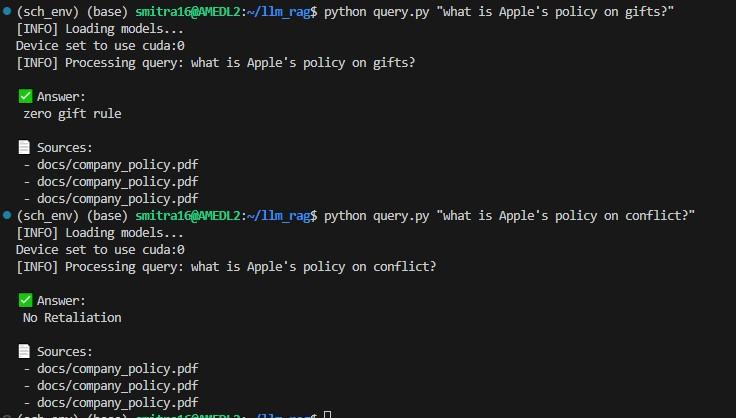

# 📄 Local LLM RAG PDF QA Tool

A **lightweight, offline-ready Retrieval-Augmented Generation (RAG)** pipeline to query PDF documents using **local embeddings** and a **local language model**. Built with `LangChain`, `FAISS`, `sentence-transformers`, and `transformers`, this project enables **privacy-conscious document Q&A** directly from the command line — no cloud APIs required.

Question asked: "How do we answer queries from local PDFs without hallucination?"
The way I answered this: Retrieval-Augmented Generation (RAG) enhances LLM performance by grounding generation in real-world documents, improving factual accuracy and reducing hallucinations. This prototype demonstrates a simple local RAG pipeline for PDF document QA.


## 🚀 Features

- 🔍 Ask **natural language questions** about any PDF (e.g., company policies, academic papers)
- 🧠 Uses **local models only** — no OpenAI or internet-based APIs
- ⚙️ Command-line interface for quick, secure use
- 📦 Production-grade structure with modular utilities and CI/CD readiness
- 🧠 Based on LangChain + FAISS + HuggingFace Transformers

---

## Technical Stack

* Python
* FAISS for vector search
* Hugging Face Transformers
* SentenceTransformers for embedding model

## 📁 Project Structure

    llm_rag/
    ├── ingest.py             # Downloads, splits, and embeds PDF
    ├── query.py              # CLI interface for asking questions
    ├── utils.py              # Shared helpers for embedding, querying, loading
    ├── docs/                 # Folder to hold input PDFs
    ├── faiss_index_local/    # Saved vector index (auto-created)
    ├── requirements.txt      # Install dependencies
    └── README.md             # Project documentation

---

## 🛠️ Installation

```bash
git clone https://github.com/your-username/local-llm-rag-pdf-qa.git
cd local-llm-rag-pdf-qa

# (Recommended) Create a virtual environment
python -m venv rag_env
source rag_env/bin/activate  # or .\rag_env\Scripts\activate on Windows

# Install dependencies
pip install -r requirements.txt

## 🧩 Models Used

| Component      | Model                                   |
|----------------|------------------------------------------|
| Embeddings     | `sentence-transformers/all-MiniLM-L6-v2` |
| LLM (CPU safe) | `google/flan-t5-base`                    |
```

You can swap these models out for larger or GPU-based models if needed.

---

## 📥 How to Ingest a PDF

This script will:
1. Download a sample PDF (if missing)
2. Chunk the text
3. Embed and store it in FAISS

```bash
python ingest.py
```
---

## ❓ How to Ask Questions (CLI)

Run a natural language query from the terminal:

    python query.py "What is Apple's policy on conflicts of interest?"

The system will return:
- ✅ A generated answer  
- 📄 The source document metadata


---

## 🧪 Example Output

    ✅ Answer:
    Employees must avoid situations where their personal interests conflict with the interests of Apple...

    📄 Sources:
     - docs/company_policy.pdf
    
    


Retrieval latency: ~1.205 seconds on GPU

## Databricks Cloud Version

- Implemented a lightweight Retrieval-Augmented Generation (RAG) pipeline entirely inside Databricks Community Edition.
- Used HuggingFace models for embedding, cosine similarity for retrieval, and optional QA generation.
- Project demonstrates Databricks environment setup, LLM-based retrieval workflows, and scalable cloud execution without file dependencies.

The notebook: databricks_notebooks/RAG_pipeline.ipynb


## 🛠️ Deployment/Design Comments

* System designed for lightweight local deployment.
* No external API calls required — fully offline retrieval and QA.
* Optimized for small footprint (under 500 MB total model size).
* Developed and deployed a Retrieval-Augmented Generation (RAG) pipeline inside Databricks Community Edition using HuggingFace models and cosine similarity retrieval.
* Demonstrated cloud-native ML pipeline development, embedding generation, retrieval workflows, and QA model integration.


---

## 🧰 Extending the Project

- 🔄 Swap in a GPU LLM like `mistralai/Mistral-7B-Instruct`
- 🌐 Add a Streamlit or Gradio UI for web access
- 📚 Embed multiple PDFs for multi-document retrieval
- ✅ Add `pre-commit`, linting, and GitHub Actions for CI/CD
- 🧪 Add test suite for core utilities

---

## 🛡️ License

This project is open-source under the [MIT License](LICENSE).

---

## 🙋‍♀️ Maintainer

**Sinjini Mitra**  
🎓 PhD in AI/ML | 🧠 Builder of interpretable, practical ML tools  
[LinkedIn](https://www.linkedin.com/in/sinjini-mitra/) 